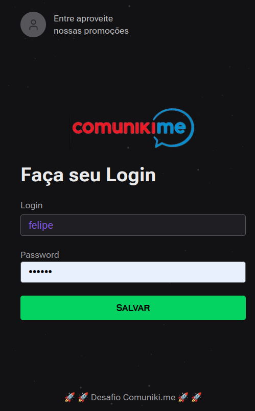

# ComunikiME Challenge

### API
The API was developed using Node.js and Express, leveraging the Routing-Controller library. This combination allows for simplified and efficient creation of endpoints, facilitating route definition and processing of HTTP requests. 

1. go to folder `cd server`
2. copy the "sample.env" and change it's name to .env
3. run `npm install`
4. run `npm run dev`

### Database
The project was developed using Prisma as the Object-Relational Mapping (ORM) tool and SQLite as the database for the development environment. This combination provides an efficient and simplified approach to handling data persistence during the development phase.

the db is available on `server folder`
1) run `npx prisma studio` (visual editor for the data in your database)
2) run `npx prisma db seed` to populate the database with fake data. Its will create 2 users.
- Login: felipe; Senha: felipe123 for role: `admin` user
- Login: comuniki; Senha: comuniki123 for role: `client` user

### Web
1. go to folder `cd web`
2. copy the "sample.env" and change it's name to .env
3. run `npm install`
4. run `npm run dev`
5. to login use login and password created by command `npm run seed`

